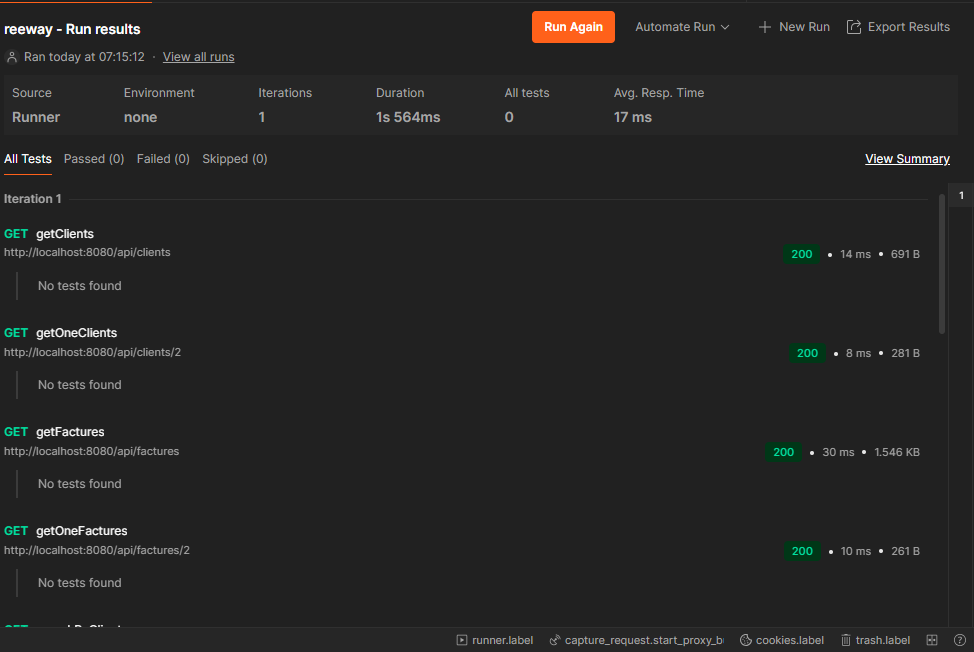
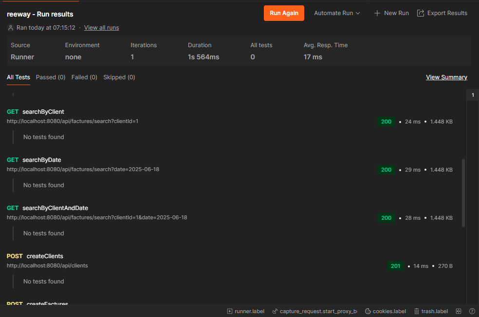
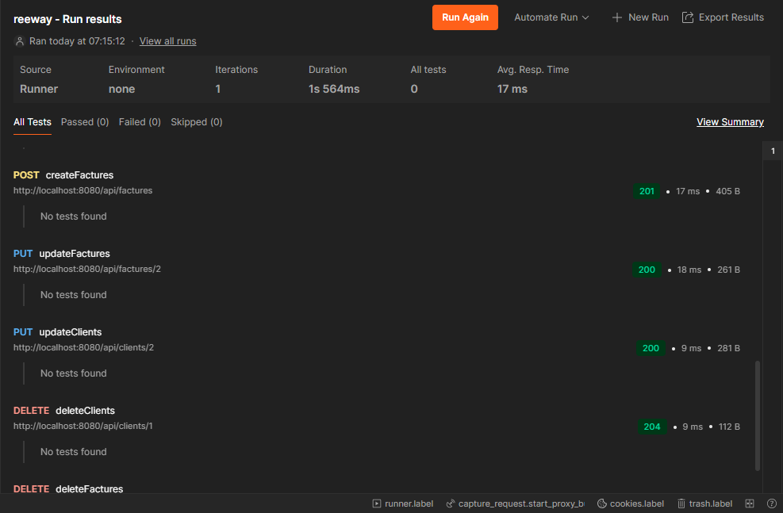

# Application de Facturation - ReeWayy 

Ceci est une application Spring Boot conçue pour gérer les clients et leurs factures. Elle fournit une API RESTful pour effectuer des opérations CRUD sur les entités `Client` et `Facture`, y compris la possibilité de rechercher des factures par ID client et par date.

## Technologies Utilisées

*   **Spring Boot**: Cadre de travail pour la création d'applications Spring autonomes et de qualité production.
*   **Spring Data JPA**: Simplifie l'accès aux données en utilisant JPA avec Spring.
*   **PostgreSQL**: Base de données relationnelle utilisée pour le stockage des données.
*   **Lombok**: Bibliothèque pour réduire le code passe-partout pour les classes Java.
*   **Maven**: Outil d'automatisation de la construction.
*   **Jakarta Validation**: Pour la validation des données.

## Instructions de Configuration

### Prérequis

*   Java Development Kit (JDK) 17 ou supérieur
*   Apache Maven
*   Serveur de base de données PostgreSQL

### Configuration de la Base de Données

1.  Assurez-vous qu'un serveur PostgreSQL est en cours d'exécution.
2.  Créez une base de données nommée `mydatabase` (ou celle de votre choix).
3.  Mettez à jour le fichier `src/main/resources/application.properties` avec vos identifiants PostgreSQL :

    ```properties
    spring.application.name=ree
    spring.datasource.url=jdbc:postgresql://localhost:5432/mydatabase
    spring.datasource.username=postgres
    spring.datasource.password=password
    spring.jpa.hibernate.ddl-auto=update
    spring.jpa.show-sql=true
    spring.jpa.properties.hibernate.format_sql=true
    ```

    *   `spring.datasource.url`: Votre URL JDBC PostgreSQL.
    *   `spring.datasource.username`: Votre nom d'utilisateur PostgreSQL.
    *   `spring.datasource.password`: Votre mot de passe PostgreSQL.
    *   `spring.jpa.hibernate.ddl-auto=update`: Cela créera/mettra à jour automatiquement les tables de la base de données en fonction de vos entités JPA.

### Exécution de l'Application

Naviguez vers le répertoire racine du projet et exécutez l'application en utilisant Maven :

```bash
./mvnw spring-boot:run
```

L'application démarrera sur `http://localhost:8080` par défaut.

## Points d'Accès API

### Clients

URL de base : `/api/clients`

#### Obtenir tous les clients

`GET /api/clients`

**Exemple de Réponse :**
```json
[
    {
        "id": 1,
        "nom": "Client A",
        "email": "clientA@example.com",
        "siret": "12345678901234",
        "dateCreation": "2023-01-15"
    }
]
```

#### Obtenir un client par ID

`GET /api/clients/{id}`

**Exemple de Réponse :**
```json
{
    "id": 1,
    "nom": "Client A",
    "email": "clientA@example.com",
    "siret": "12345678901234",
    "dateCreation": "2023-01-15"
}
```

#### Créer un nouveau client

`POST /api/clients`

**Exemple de Corps de Requête :**
```json
{
    "nom": "Nouveau Client",
    "email": "nouveauclient@example.com",
    "siret": "98765432109876"
}
```

**Exemple de Réponse (201 Created) :**
```json
{
    "id": 2,
    "nom": "Nouveau Client",
    "email": "nouveauclient@example.com",
    "siret": "98765432109876",
    "dateCreation": "2023-10-26"
}
```

#### Mettre à jour un client existant

`PUT /api/clients/{id}`

**Exemple de Corps de Requête :**
```json
{
    "nom": "Nom Client Mis à Jour",
    "email": "misajour@example.com",
    "siret": "98765432109876"
}
```

**Exemple de Réponse :**
```json
{
    "id": 2,
    "nom": "Nom Client Mis à Jour",
    "email": "misajour@example.com",
    "siret": "98765432109876",
    "dateCreation": "2023-10-26"
}
```

#### Supprimer un client

`DELETE /api/clients/{id}`

**Réponse :** 204 No Content

### Factures

URL de base : `/api/factures`

#### Obtenir toutes les factures

`GET /api/factures`

**Exemple de Réponse :**
```json
[
    {
        "id": 101,
        "clientId": 1,
        "date": "2023-01-20",
        "lignes": [
            {
                "id": 1,
                "description": "Article 1",
                "quantite": 2.0,
                "prixUnitaireHT": 50.0,
                "tauxTVA": 0.2
            }
        ],
        "totalHT": 100.0,
        "totalTVA": 20.0,
        "totalTTC": 120.0
    }
]
```

#### Obtenir une facture par ID

`GET /api/factures/{id}`

**Exemple de Réponse :**
```json
{
    "id": 101,
    "clientId": 1,
    "date": "2023-01-20",
    "lignes": [
        {
            "id": 1,
            "description": "Article 1",
            "quantite": 2.0,
            "prixUnitaireHT": 50.0,
            "tauxTVA": 0.2
        }
    ],
    "totalHT": 100.0,
    "totalTVA": 20.0,
    "totalTTC": 120.0
}
```

#### Créer une nouvelle facture

`POST /api/factures`

**Exemple de Corps de Requête :**
```json
{
    "clientId": 1,
    "date": "2023-10-26",
    "lignes": [
        {
            "description": "Service A",
            "quantite": 1.0,
            "prixUnitaireHT": 150.0,
            "tauxTVA": 0.2
        },
        {
            "description": "Produit B",
            "quantite": 3.0,
            "prixUnitaireHT": 25.0,
            "tauxTVA": 0.1
        }
    ]
}
```

**Exemple de Réponse (201 Created) :**
```json
{
    "id": 102,
    "clientId": 1,
    "date": "2023-10-26",
    "lignes": [
        {
            "id": 2,
            "description": "Service A",
            "quantite": 1.0,
            "prixUnitaireHT": 150.0,
            "tauxTVA": 0.2
        },
        {
            "id": 3,
            "description": "Produit B",
            "quantite": 3.0,
            "prixUnitaireHT": 25.0,
            "tauxTVA": 0.1
        }
    ],
    "totalHT": 225.0,
    "totalTVA": 37.5,
    "totalTTC": 262.5
}
```

#### Mettre à jour une facture existante

`PUT /api/factures/{id}`

**Exemple de Corps de Requête :**
```json
{
    "clientId": 1,
    "date": "2023-10-27",
    "lignes": [
        {
            "id": 2,
            "description": "Service A Mis à Jour",
            "quantite": 1.0,
            "prixUnitaireHT": 160.0,
            "tauxTVA": 0.2
        }
    ]
}
```

**Exemple de Réponse :**
```json
{
    "id": 102,
    "clientId": 1,
    "date": "2023-10-27",
    "lignes": [
        {
            "id": 2,
            "description": "Service A Mis à Jour",
            "quantite": 1.0,
            "prixUnitaireHT": 160.0,
            "tauxTVA": 0.2
        }
    ],
    "totalHT": 160.0,
    "totalTVA": 32.0,
    "totalTTC": 192.0
}
```

#### Supprimer une facture

`DELETE /api/factures/{id}`

**Réponse :** 204 No Content

#### Rechercher des factures

`GET /api/factures/search`

**Paramètres de Requête :**
*   `clientId` (Optionnel) : Filtrer par ID client.
*   `date` (Optionnel) : Filtrer par date de facture (format : `YYYY-MM-DD`).

**Exemple :** `GET /api/factures/search?clientId=1&date=2023-10-26`

**Exemple de Réponse :**
```json
[
    {
        "id": 102,
        "clientId": 1,
        "date": "2023-10-26",
        "lignes": [
            {
                "id": 2,
                "description": "Service A",
                "quantite": 1.0,
                "prixUnitaireHT": 150.0,
                "tauxTVA": 0.2
            }
        ],
    "totalHT": 150.0,
    "totalTVA": 30.0,
    "totalTTC": 180.0
    }
]
```

## Screenshots






